# Remote sensing of algal blooms: the case of Lough Neagh
### 07/09/2026 exam - Spatial Ecology in R 
#### Emy Filippi Quintussi

## 1. Introduction :clipboard:

Lough Neagh is UK's largest freshwater lake, it is situated in Northern Ireland, spanning around 380 square kilometres. 
In recent years it has been affected by severe algal blooms, raising concerns about the safety of the drinking water drawn from it, negatively impacting local activities and posing threats to biodiversity. 

During the year 2023, the lake experienced a particularly intense proliferation of cyanobacteria (i.e. the microorganisms causing algal blooms), due multiple causes, such as: eutrophication caused by agriculture run-off, global warming, invasive species, and the calm weather conditions of that year.

Remote sensing can be a useful tool for monitoring algal blooms, allowing spatial observations that couldn’t be possible with traditional in-situ sampling.

<p align="center">
  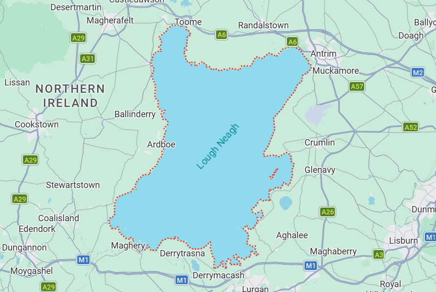
</p>

###  Aim of the analysis 
The aim of this analysis is to utilise remote sensing techniques to monitor the algal blooms of Lough Neagh during the year 2023, comparing their intensity across seasons.

## 2. Methodology overview :bookmark_tabs:
### 2.1 Time period
In this analysis the four metereological seasons of the year 2023, starting from spring, were monitored:

 - spring: 01/03 - 31/05/2023
 - summer: 01/06 - 31/08/2023
 - autumn: 01/09 - 30/11/2023
 - winter: 01/12/2023 - 28/02/2024

### 2.2 Satellite imagery :artificial_satellite:
The satellite images, one for each season, were downloaded from the Sentinel-2 dataset, using [Google Earth Engine](https://earthengine.google.com/). 
The area of interest was selected manually on the map. 
A cloud filter was applied to extract only images with less than 30% cloud coverage; if a season had more than one image meeting this criterion, the median of the images was computed. 
Despite the filter some of the images were still disturbed by clouds, so a cloud mask was applied, exploiting the pixel classification built in Sentinel-2 data.
> [!NOTE]
> the JavaScript code used on Google Earth Engine for each season can be found in the folder "JavaScript" 

### 2.3 Indexes :chart_with_upwards_trend:
The indexes used in this analysis are:

 - **NDWI** (Normalized Difference Water Index)
 - **NDVI** (Normalized Difference Vegetation Index)
 - **NDCI** (Normalized Difference Chlorophyll Index)

#### 2.3.1 NDWI
The NDWI is used to monitor changes related to water content in water bodies was used to detect the water’s surface. In this analysis it was used to separate the lake from the sorrounding land, in order to perform the next analyses only on the area within the lake. 
The NDWI formula is the following:

$$
NDWI = \frac{GREEN - NIR}{GREEN + NIR}
$$


#### 2.3.2 NDVI
The NDVI is one of the most used vegetation indexes for assessing vegetation health, density, and photosynthetic activity. It considers the difference between the NIR and the red reflectance; since healthy plants, due to their chlorophyll content, tend to absorb red light and reflect NIR light, it can be used to assess the presence of plants, their characteristics (grass, shrubs, forests etc.), and their health. 
The formula is the following:

$$
NDVI = \frac{NIR - RED}{NIR + RED}
$$

It is conventionally applied to land vegetation, but in this analysis it was employed to assess the presence of vegetation within the lake, considering it a proxy of eutrophication, although it has the limitation of not being able to discriminate the photosynthetic activity of aquatic plants from the one of cyanobacteria.

#### 2.3.3 NDCI
The NDCI is a novel index developed with the objective of improving the chl-_a_ retrieval in turbid productive waters. This index has been applied in several studies to assess algal blooms because chl-_a_ is the main photosynthetic pigment of cyanobacteria.

The formula is the following:

$$
NDCI = \frac{RED Edge - RED}{RED Edge + RED}
$$

> In Sentinel-2 the bands used in this analysis are:
> - RED: B4
> - RED Edge: B5
> - GREEN: B3
> - BLUE: B2
> - NIR: B8

## 3. R analysis :desktop_computer:
> [!NOTE]
> the R code used for this analysis can be found in the file "R_script.R"

The first step is setting the working directory:
````r
setwd("C:/Users/utente/Desktop/R_exam")
````
Then the libraries of the necessary packages were loaded:
````r
library("terra")
library("imageRy")
library("viridis")
library("ggplot2")
library("tidyverse")
````
After that, the satellite images were imported as raster files and plotted. 

````r
#import the spring rast image
spring<-rast("Spring.tif")

#plot spring
plot(spring, col=viridis::turbo(100))
````
<p align="center">
  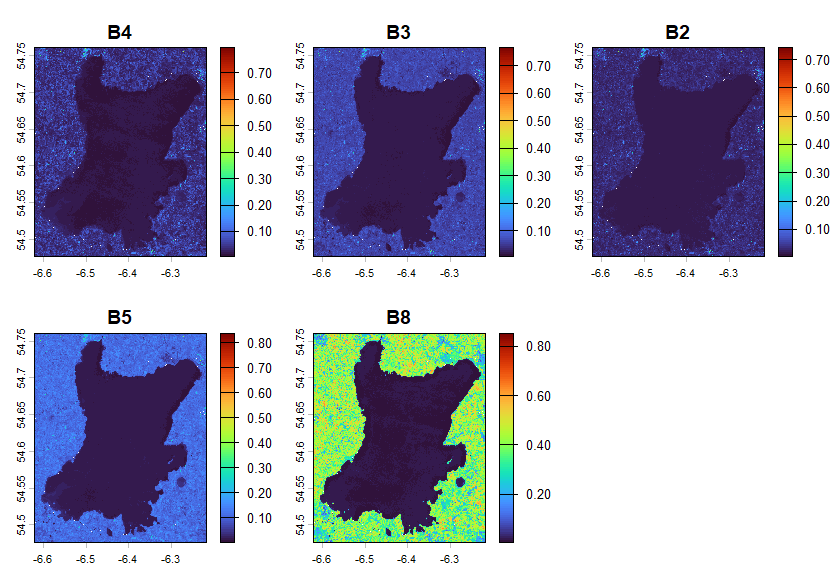
</p>

> Spring plot

````r

#import the summer rast image
summer<-rast("Summer.tif")

spring
summer
compareGeom(spring, summer) #error: the two images do not align, they have different coordinates systems
````
It was found that the images did not match, because they had different coordinates systems: Projected-WGS84 for spring and UTM-WGS84 for summer. To solve this issue, the spring image was chosen as model and the others were projected on it, in order to standardize the coordinates systems and align the pixels.

````r
#project summer over spring to make them match
summer_aligned<-project(summer, spring)
#check that they now match
compareGeom(spring, summer_aligned) #it returns "TRUE"
summer<-summer_aligned

#plot summer
plot(summer, col=viridis::turbo(100))
````
<p align="center">
  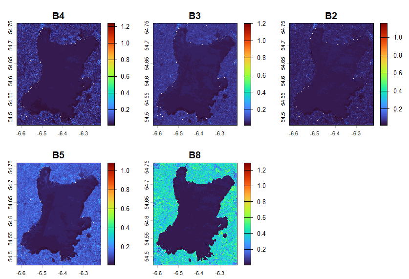
</p>

> Summer plot

````r
#import the autumn rast image and align it
autumn<- rast("Autumn.tif")
autumn_aligned <- project(autumn, spring)
autumn <- autumn_aligned
compareGeom(spring, autumn) #it returns "TRUE"

#plot autumn
plot(autumn,col=viridis::turbo(100))
````
<p align="center">
  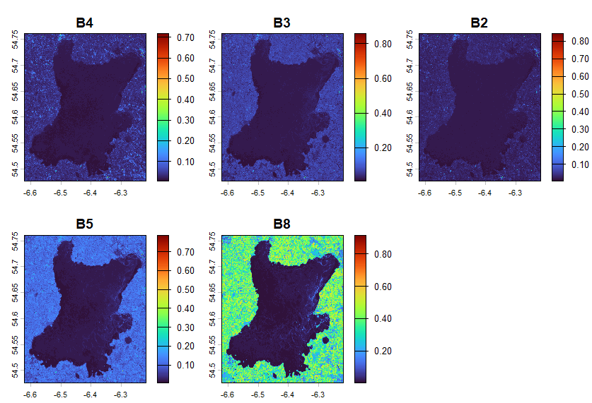
</p>

> Autumn plot

````r
#import the winter rast image and align it
winter<-rast("Winter.tif")
#the "project" function alone failed, alternative: align the image in two steps
winter_lonlat <- project(winter, "EPSG:4326")     #step 1: change coordinates systems
winter_aligned <- resample(winter_lonlat, spring) #step 2 : align the pixels grids
winter<-winter_aligned
compareGeom(spring, winter) #it returns "TRUE"

#plot winter
plot(winter,col=viridis::turbo(100))
````
<p align="center">
  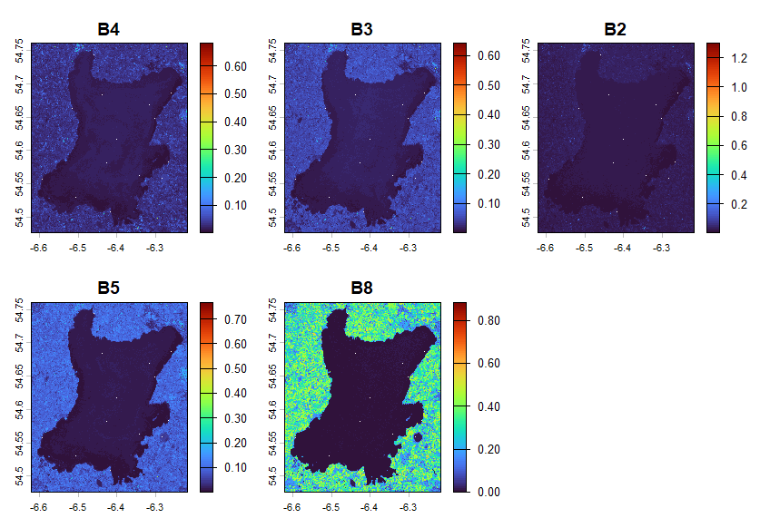
</p>

> Winter plot

> [!NOTE]
> The plots show some missing pixels that have probably been caused by the cloud mask applied when retriving the images from Google Earth Engine. Since they are only a few, over a large area of hundreds of square kilometrers, they should't affect the results of the analysis.  

### 3.1 RGB colours visualization :art:
````r
#visualize the images in RGB colours
par(mfrow = c(2, 2))
par(col.main = "white")
im.plotRGB(spring, r = 1, g = 2, b = 3, title = "Spring")
im.plotRGB(summer, r = 1, g = 2, b = 3, title = "Summer")
im.plotRGB(autumn, r = 1, g = 2, b = 3, title = "Autumn")
im.plotRGB(winter, r = 1, g = 2, b = 3, title = "Winter")
dev.off()
````
<p align="center">
  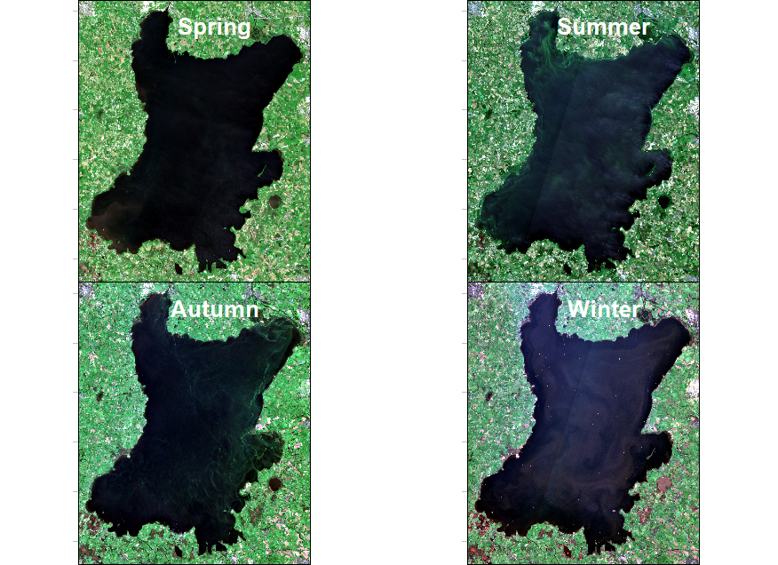
</p>

> RGB plot of the four seasons

#### 3.1.1 Results
In summer and autumn, green swirls that probably indicate intense algal blooms, are clearly visible on the lake's surface. In summer they are concentrated in the North-West portion of the lake; in autumn they occupy a larger area, they can be observed along the entire East shore, as well as in the previous area (albeit less conspicuous than in summer).
In spring and winter no distinct evidences of algal blooms can be observed.

### 3.2 Lake's area isolation :national_park:
In order to isolate the area of the lake's surface from the surrounding land it was used the NDWI. It was selected a threshold value of -0.1 to distinguish water from the other types of land cover: 
-	NDWI > -0.1: water
-	NDWI < -0.1: non-water

Then a mask was created to maintain only the water pixels, converting non-water pixels to NA data. It was chosen to utilize a static mask, calculated over the spring image and then applied to the other seasons.

````r
#Isolate the lake from the land using the NDWI (Normalized Difference Water Index)

#calculate the NDWI 
ndwi_spring <- (spring[["B3"]] - spring[["B8"]]) / (spring[["B3"]]  + spring[["B8"]])

#create a water mask: TRUE (1) for water, FALSE (0) for non-water
water_mask <- ndwi_spring > -0.1  #ndwi values above -0.1 identify water
water_mask[water_mask == 0] <- NA #convert non-water pixel to NA

#apply the water mask and check results
spring_lake <- mask(spring, water_mask)
plot(spring_lake)
````
<p align="center">
  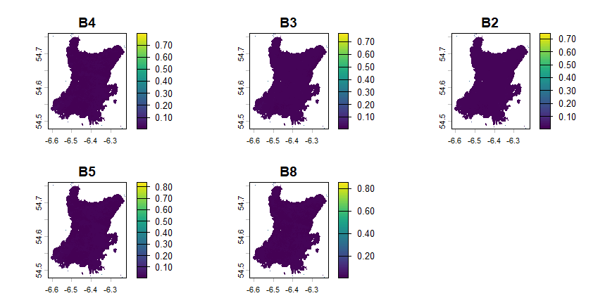
</p>

> Spring plot of the area within the lake

````r
#apply the mask to all the seasons
summer_lake <- mask(summer, water_mask)
autumn_lake <- mask(autumn, water_mask)
winter_lake <- mask(winter, water_mask)
````

### 3.3 Water surface classification - NDVI :world_map:

The NDVI can assume values between -1 and +1, generally positive values indicate the presence of vegetation, while negative values are associated to bare soil, water and snow. 
````r
#calculate the NDVI (Normalized Difference Vegetation Index)
ndvi_spring <- (spring_lake[["B8"]] - spring_lake[["B4"]]) / (spring_lake[["B8"]] + spring_lake[["B4"]])
ndvi_summer <- (summer_lake[["B8"]] - summer_lake[["B4"]]) / (summer_lake[["B8"]] + summer_lake[["B4"]])
ndvi_autumn <- (autumn_lake[["B8"]] - autumn_lake[["B4"]]) / (autumn_lake[["B8"]] + autumn_lake[["B4"]])
ndvi_winter <- (winter_lake[["B8"]] - winter_lake[["B4"]]) / (winter_lake[["B8"]] + winter_lake[["B4"]])

par(mfrow = c(2, 2))
plot(ndvi_spring, main="NDVI Spring", col=viridis::mako(100))
plot(ndvi_summer, main="NDVI Summer", col=viridis::mako(100))
plot(ndvi_autumn, main="NDVI Autumn", col=viridis::mako(100))
plot(ndvi_winter, main="NDVI Winter", col=viridis::mako(100))
dev.off()
````
<p align="center">
  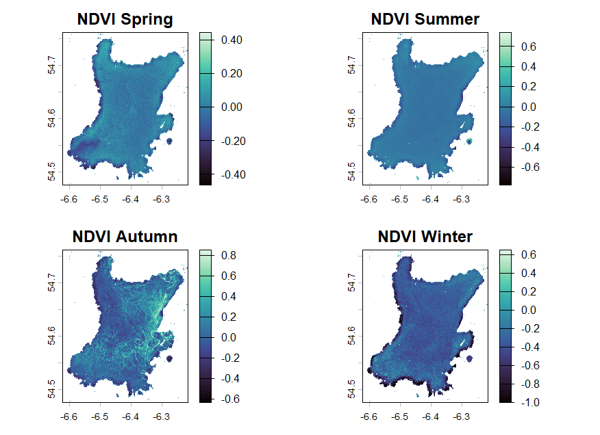
</p>

> NDVI plot of the four seasons: It can be observed that most seasons, but especially autumn, have areas of the lake with NDVI values that are usually associated to vegetation (>0).

To classify the water surface using NDVI values, the following classes were created: 
- **Water**: -Inf < NDVI < -0.2
- **Shallow Turbid Water**: -0.2 < NDVI < 0.0
- **Sparse Vegetation**: 0.0 < NDVI < 0.2
- **Dense Vegetation**: 0.2 < NDVI < Inf

> [!NOTE]
> The classes were based on the work of Selvarajan (2026)

````r
#classify the area using the NDVI
class_matrix_ndvi <- matrix(c(
  -Inf,  -0.2,  1,   # Class 1: Water 
  -0.2,  0.0,  2,   # Class 2: Shallow Turbid Water
  0.0,  0.2,  3,   # Class 3: Sparse Vegetation
  0.2,  Inf,  4    # Class 4: Dense Vegetation
), ncol = 3, byrow = TRUE)


ndvi_colours <-c("cadetblue1","#CDB79E","#9AFF9A","#698B69")

par(mfcol = c(2,3),oma = c(1, 1, 3, 0))
#spring classification
spring_ndvi_classified <- classify(ndvi_spring, class_matrix_ndvi)
plot(spring_ndvi_classified, 
     col = ndvi_colours, 
     main = "Spring",
     type = "classes")

#summer classification
summer_ndvi_classified <- classify(ndvi_summer, class_matrix_ndvi)
plot(summer_ndvi_classified, 
     col = ndvi_colours, 
     main = "Summer",
     type = "classes")

#autumn classification
autumn_ndvi_classified <- classify(ndvi_autumn, class_matrix_ndvi)
plot(autumn_ndvi_classified, 
     col = ndvi_colours, 
     main = "Autumn",
     type = "classes")

#winter classification
winter_ndvi_classified <- classify(ndvi_winter, class_matrix_ndvi)
plot(winter_ndvi_classified, 
     col = ndvi_colours, 
     main = "Winter",
     type = "classes")

mtext("NDVI classification", 
      side = 3,        # 3 = top margin
      outer = TRUE,    # Place it in the outer margin space
      line = 1,        # Distance from the top plot boundary
      font = 2,        # Bold text
      cex = 1.3)       # Title text size
par(mfrow = c(1, 1))
legend("right", 
       legend = c("Water", 
                  "Shallow Turbid Water", 
                  "Sparse Vegetation", 
                  "Dense Vegetation"), 
       fill = ndvi_colours,
       xpd = NA,
       inset = -0.3,
       cex = 0.8)
dev.off()
````
<p align="center">
  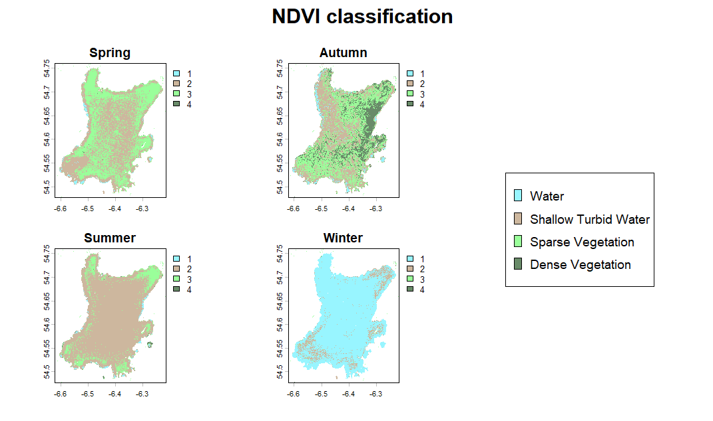
</p>

#### 3.3.1 Results

The classification based on the NDVI shows that in all of the seasons, except winter, the waters of the lake are almost never clear. 

In spring sparse vegetation is distributed across the entire lake, saving the zones right beside the shores and the South-West corner, also towards the centre of the lake it becomes less prevalent. 
In summer the main class is shallow turbid water, but some sparse vegetation can still be observed at the corners and near the shores. 
In autumn, a vast portion of the lake is occupied by sparse vegetation, and along the East shore a large area that extends toward the centre is classified as dense vegetation, showing intense photosynthetic activity.
In winter the majority of the lake’s surface is classified as water, with only some small portions being shallow turbid water.

### 3.4 Water surface classification - NDCI :world_map:

Similarly to the NDVI, the NDCI can assume values between -1 and +1, with positive values indicating photosynthetic activity associated to the presence of chl-_a_.

````r
#calculate the NDCI (Normalized Difference Chlorophyll Index)
ndci_spring <- (spring_lake[["B5"]] - spring_lake[["B4"]]) / (spring_lake[["B5"]] + spring_lake[["B4"]])
ndci_summer <- (summer_lake[["B5"]] - summer_lake[["B4"]]) / (summer_lake[["B5"]] + summer_lake[["B4"]])
ndci_autumn <- (autumn_lake[["B5"]] - autumn_lake[["B4"]]) / (autumn_lake[["B5"]] + autumn_lake[["B4"]])
ndci_winter <- (winter_lake[["B5"]] - winter_lake[["B4"]]) / (winter_lake[["B5"]] + winter_lake[["B4"]])

par(mfrow = c(2, 2))
plot(ndci_spring, main="NDCI Spring", col=viridis::inferno(100))
plot(ndci_summer, main="NDCI Summer", col=viridis::inferno(100))
plot(ndci_autumn, main="NDCI Autumn", col=viridis::inferno(100))
plot(ndci_winter, main="NDCI Winter", col=viridis::inferno(100))
dev.off()
````
<p align="center">
  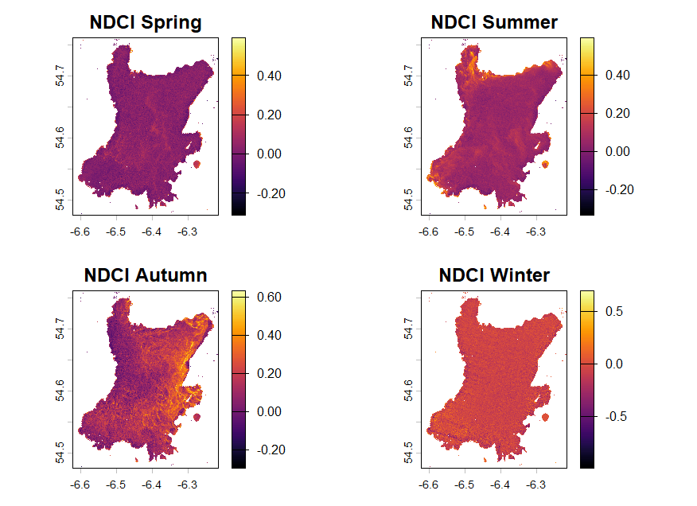
</p>

> NDCI plot of the four seasons: can be observed that during most seasons the lake's surface presents areas with NDCI values above 0, with autumn showing particularly noticeable portions with high values.

To classify the water surface using NDCI values, the following classes were created: 
 - **Oligotrophic/clean water** : - Inf < NDCI < -0.1
 - **Low algae content**: -0.1 < NDCI < 0.0
 - **Moderate eutrophic** : 0.0 < NDCI < 0.1
 - **High eutrophic**: 0.1 < NDCI < 0.2
 - **Very high algae biomass**: 0.2 < NDCI < 0.4
 - **Algal bloom conditions**: 0.4 < NDCI < 0.5
 - **Severe bloom/hypereutrophic**: 0.5 < NDCI < Inf

> [!NOTE]
> The classes were based on the work of Ahmad (2025)

````r
#classify the area using the NDCI
class_matrix_ndci <- matrix(c(
  -Inf,  -0.1,  1,   # Class 1: Oligotrophic/clean water 
  -0.1,   0.0,  2,   # Class 2: Low algae content
   0.0,  0.1,  3,    # Class 3: Moderate eutrophic 
   0.1,  0.2,  4,    # Class 4: High eutrophic 
   0.2,  0.4,  5,    # Class 5: Very high algae biomass
   0.4,  0.5,  6,    # Class 6: Algal bloom conditions
   0.5,  Inf,  7     # Class 7: Severe bloom/hypereutrophic
), ncol = 3, byrow = TRUE)

  
par(mfcol = c(2, 3), oma = c(1, 1, 3, 0)) 
#spring classification
spring_ndci_classified <- classify(ndci_spring, class_matrix_ndci)
plot(spring_ndci_classified, 
     col = viridis::turbo(7), 
     main = "Spring",
     type = "classes")

#summer classification
summer_ndci_classified <- classify(ndci_summer, class_matrix_ndci)
plot(summer_ndci_classified, 
     col = viridis::turbo(7), 
     main = "Summer",
     type = "classes")

#autumn classification
autumn_ndci_classified <- classify(ndci_autumn, class_matrix_ndci)
plot(autumn_ndci_classified, 
     col = viridis::turbo(7), 
     main = "Autumn",
     type = "classes")

#winter classification
winter_ndci_classified <- classify(ndci_winter, class_matrix_ndci)
plot(winter_ndci_classified, 
     col = viridis::turbo(7), 
     main = "Winter",
     type = "classes")

mtext("NDCI Classification: eutrophication level", 
      side = 3,        # 3 = top margin
      outer = TRUE,    # Place it in the outer margin space
      line = 1,        # Distance from the top plot boundary
      font = 2,        # Bold text
      cex = 1.3)       # Title text size
par(mfrow=c(1,1))
legend("right", 
       legend = c("Oligotrophic/clean water", 
                  "Low algae content", 
                  "Moderate eutrophic", 
                  "High eutrophic", 
                  "Very high algae biomass", 
                  "Algal bloom conditions", 
                  "Severe bloom/hypereutrophic"), 
       fill = viridis::turbo(7),
       xpd = NA,
       inset = -0.3,
       cex = 0.8)
dev.off()
````

<p align="center">
  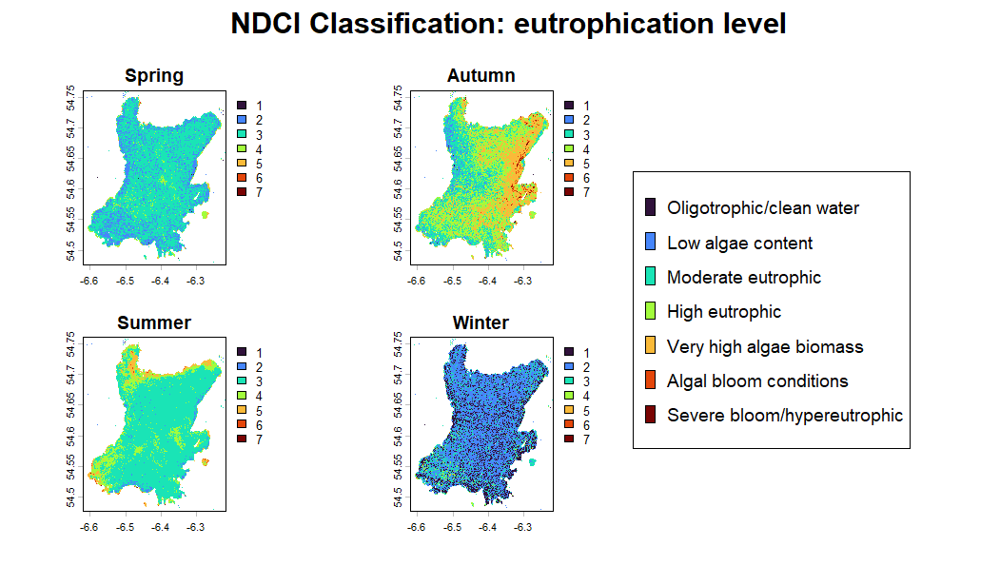
</p>

#### 3.4.1 Results
The classification based on the NDCI shows the level of eutrophication of the lake’s waters across the four seasons. 

In spring the majority of the lake results to be moderate eutrophic, while in summer there are also some noticeable areas classified as high eutrophic and very high algae biomass.
In accordance with the results obtained through the NDVI, in autumn an area with intense eutrophication along the East shore is identified.
In winter the lake appears to have mainly low algae content and clean water, with only some spots of moderate eutrophic conditions concentrated in the South-West corner.

### 3.4 Multitemporal comparison - NDVI :bar_chart:
In order to visualize how the lake waters chenged across seasons, firstly the percentages of each class were calculated, then the results were presented in a barplot. 
##### Percentages
````r
#multitemporal comparison of the NDVI classes across seasons
#calculate the frequencies of each class
freq_ndvi_spring <- freq(spring_ndvi_classified)
freq_ndvi_summer<- freq(summer_ndvi_classified)
freq_ndvi_autumn <- freq(autumn_ndvi_classified)
freq_ndvi_winter <- freq(winter_ndvi_classified)
#calculate the percentages of each class
perc_ndvi_spring = freq_ndvi_spring$count * 100 / sum(freq_ndvi_spring$count) #use sum to avoid counting masked pixels
perc_ndvi_summer = freq_ndvi_summer$count * 100 / sum(freq_ndvi_summer$count) 
perc_ndvi_autumn = freq_ndvi_autumn$count * 100 / sum(freq_ndvi_autumn$count) 
perc_ndvi_winter = freq_ndvi_winter$count * 100 / sum(freq_ndvi_winter$count) 
#create a table
ndvi_category_labels <- c(
  "Water", 
  "Shallow Turbid Water", 
  "Sparse Vegetation", 
  "Dense Vegetation")
ndvi_table <- data.frame(
  Category = ndvi_category_labels ,
  Spring = round(perc_ndvi_spring, 2), #round to two decimals
  Summer = round(perc_ndvi_summer, 2),
  Autumn = round(perc_ndvi_autumn, 2),
  Winter = round(perc_ndvi_winter, 2))
print(ndvi_table)
````
| **Category**          | **Spring** | **Summer** | **Autumn** | **Winter** |
|-----------------------|------------|------------|------------|------------|
| Water                 | 1.41       | 1.61       | 3.46       | 89.36      |
| Shallow Turbid Water  | 50.92      | 84.11      | 37.63      | 9.91       |
| Sparse Vegetation     | 47.52      | 13.62      | 40.23      | 0.67       |
| Dense Vegetation      | 0.15       | 0.67       | 18.69      | 0.06       |

##### Barplot
````r
#turn the wide table into a long table 
ndvi_table_long <- ndvi_table %>% 
  pivot_longer(-Category)  #transform all of the columns except "Category"
ndvi_table_long <- rename(ndvi_table_long, Season=name, Percentage=value)

ndvi_table_long <- as.data.frame(ndvi_table_long) #transform the tibble into a data.frame 
ndvi_table_long$Category <- replace_values(ndvi_table_long$Category,
                                           from = c("Water", "Shallow Turbid Water", "Sparse Vegetation", "Dense Vegetation"),
                                           to = c("1", "2", "3", "4"))


#plot the graph
ggplot(ndvi_table_long, aes(x=Season, y=Percentage, fill=Category)) +                            
  geom_bar(stat="identity", position="dodge") +                                           
  geom_text(aes(label=round(Percentage,1)),
            position=position_dodge(width=0.9),
            vjust=-0.25,size=3) +                                                        
  scale_fill_manual(name="Category",
                    label=c("Water", "Shallow Turbid Water", "Sparse Vegetation", "Dense Vegetation"),
                    values=ndvi_colours) +                                                               
  ylim(0,100) +                                                                          
  labs(title="Percentages of the NDVI classes across seasons",
       y="Percentage (%)", x="Season") +
  theme_minimal()
````
<p align="center">
  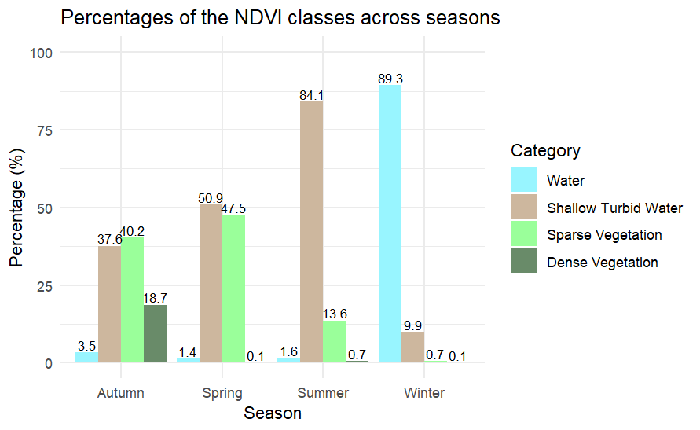
</p>

#### 3.4.1 Results
The barplot shows that the water class category is prevalent only in winter. 
In spring and summer, the most represented class is shallow turbid water, but while in summer it takes up the vast majority of the lake, in spring it occupies only 50.9% of the area, while the rest is mainly sparse vegetation.
Autumn is the only season in which the vegetation classes occupy more area than the water classes, with sparse vegetation and dense vegetation covering 40.2% and 18.7% of the lake, respectively.

### 3.5 Multitemporal comparison - NDCI :bar_chart:
##### Percentages
````r
#multitemporal comparison of the NDCI classes across seasons
#calculate the frequencies of each class
freq_ndci_spring <- freq(spring_ndci_classified) 
freq_ndci_summer <- freq(summer_ndci_classified)
freq_ndci_autumn <- freq(autumn_ndci_classified)
freq_ndci_winter <- freq(winter_ndci_classified)
#calculate the percentages of each class
perc_ndci_spring = freq_ndci_spring$count * 100 / sum(freq_ndci_spring$count) #use sum to avoid counting masked pixels
perc_ndci_summer = freq_ndci_summer$count * 100 / sum(freq_ndci_summer$count) 
perc_ndci_autumn = freq_ndci_autumn$count * 100 / sum(freq_ndci_autumn$count) 
perc_ndci_winter = freq_ndci_winter$count * 100 / sum(freq_ndci_winter$count) 
#create a table
ndci_category_labels <- c("Oligotrophic/clean water", 
                          "Low algae content", 
                          "Moderate eutrophic", 
                          "High eutrophic", 
                          "Very high algae biomass", 
                          "Algal bloom conditions", 
                          "Severe bloom/hypereutrophic")
ndci_table <- data.frame(
  Category = ndci_category_labels ,
  Spring = round(perc_ndci_spring, 2), #round to two decimals
  Summer = round(perc_ndci_summer, 2),
  Autumn = round(perc_ndci_autumn, 2),
  Winter = round(perc_ndci_winter, 2))
print(ndci_table)
````
| **Category**                | **Spring** | **Summer** | **Autumn** | **Winter** |
|-----------------------------|------------|------------|------------|------------|
| Oligotrophic/clean water    | 0.09       | 0.02       | 0.12       | 26.41      |
| Low algae content           | 22.62      | 2.27       | 4.86       | 56.19      |
| Moderate eutrophic          | 72.51      | 76.93      | 29.65      | 15.31      |
| High eutrophic              | 3.93       | 15.72      | 39.50      | 1.79       |
| Very High algae biomass     | 0.82       | 4.71       | 24.13      | 0.28       |
| Algal bloom conditions      | 0.02       | 0.34       | 1.43       | 0.01       |
| Severe bloom/hypereutrophic | 0.00       | 0.01       | 0.32       | 0.00       |

##### Barplot
````r
#turn the wide table into a long table 
ndci_table_long <- ndci_table %>% 
  pivot_longer(-Category)  #transform all of the columns except "Category"
ndci_table_long <- rename(ndci_table_long, Season=name, Percentage=value)

ndci_table_long <- as.data.frame(ndci_table_long) #transform the tibble into a data.frame 
ndci_table_long$Category <- replace_values(ndci_table_long$Category,
                                           from = c("Oligotrophic/clean water", 
                                                    "Low algae content", 
                                                    "Moderate eutrophic", 
                                                    "High eutrophic", 
                                                    "Very high algae biomass", 
                                                    "Algal bloom conditions", 
                                                    "Severe bloom/hypereutrophic"),
                                           to = c("1", "2", "3", "4","5","6","7"))
ndci_colours <- viridis::turbo(7)

#plot the graph
ggplot(ndci_table_long, aes(x=Season, y=Percentage, fill=Category)) +                            
  geom_bar(stat="identity", position="dodge") +                                           
  geom_text(aes(label=round(Percentage,1)),
            position=position_dodge(width=0.9),
            vjust=-0.25,size=2.5) +                                                        
  scale_fill_manual(name="Category",
                    label= c("Oligotrophic/clean water", 
                             "Low algae content", 
                             "Moderate eutrophic", 
                             "High eutrophic", 
                             "Very high algae biomass", 
                             "Algal bloom conditions", 
                             "Severe bloom/hypereutrophic"),
                    values= ndci_colours) +                                                               
  ylim(0,100) +                                                                          
  labs(title="Percentages of the NDVI classes across seasons",
       y="Percentage (%)", x="Season") +
  theme_minimal()  
````
<p align="center">
  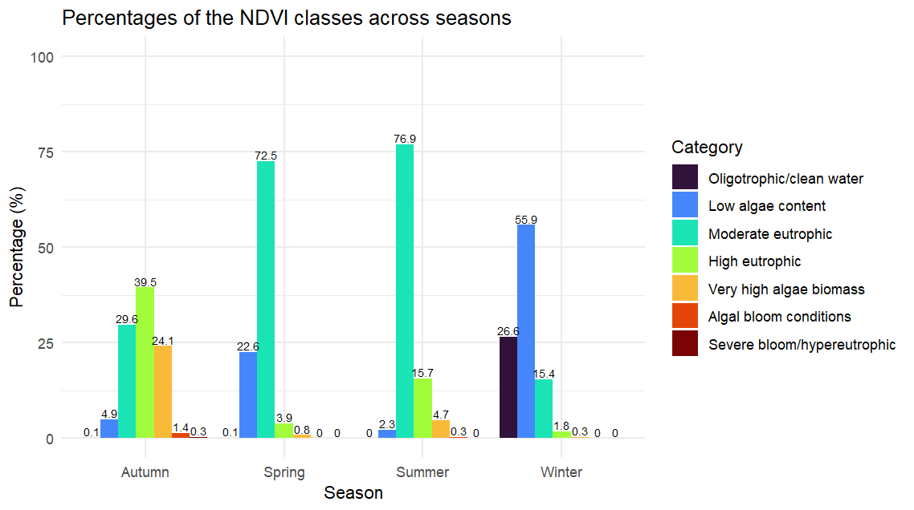
</p>

#### 3.5.1 Results 
The barplot shows that clean water is almost exclusively present in winter, and that also in this season it isn’t the main component of the lake, being far surpassed by water with low algae content.
The lake appears to be mostly moderate eutrophic in spring and summer. 
The “high eutrophic”, “very high algae biomass” and “algal bloom conditions” categories, tend to increase from spring to autumn, dropping again in winter. 
Autumn is the season showing the most concerning state, with the majority of the waters being classified as high and very high eutrophic.

## Conclusions :pushpin:
Both indexes showed that Lough Neagh in 2023 experienced intense algal blooms during autumn, especially along the East shore, while winter is consistently, and expectedly, the season with the lowest levels of eutrophication.

It was expected, due to climatic reasons, that summer would’ve had the highest algal blooms incidence, while as stated above, according to this analysis autumn was more affected. Looking at the NDVI results, summer appears to have been even less affected than spring; conversely, the NDCI results show that summer had higher levels of eutrophication compared to spring.

These differences are probably due to the fact that the NDCI is better suited to identify the presence of chl-_a_ , so it was able to detect cyanobacteria photosynthetic activity more accurately. To verify this, further studies correlating in-situ samples, showing the actual eutrophication levels, with remote sensing indexes are needed. 

## Bibliography :books:
Ahmad, H. (2025). High‐resolution spatiotemporal monitoring of water quality and trophic status in bay st. Louis using sentinel‐2 ndci time series on google earth engine. Transactions in GIS, 29(8), e70166. https://doi.org/10.1111/tgis.70166

Delowar, S., & Scrimshaw, M. (2025). A satellite-based approach to investigating eutrophication in lakes receiving wastewater treatment effluent: A case study of lake windermere. https://doi.org/10.32942/X2K94H

Dwyer, O. (2023, ottobre 19). Lough Neagh: How climate change intensified toxic algae on the UK’s largest lake. Carbon Brief. https://www.carbonbrief.org/lough-neagh-how-climate-change-intensified-toxic-algae-on-the-uks-largest-lake

Earth Science Data Systems, N. (2024, settembre 30). Normalized difference vegetation index (Ndvi) | nasa earthdata [Topic Page]. Earth Science Data Systems, NASA. Earth Data. https://www.earthdata.nasa.gov/topics/land-surface/normalized-difference-vegetation-index-ndvi

Mishra, S., & Mishra, D. R. (2012). Normalized difference chlorophyll index: A novel model for remote estimation of chlorophyll-a concentration in turbid productive waters. Remote Sensing of Environment, 117, 394–406. https://doi.org/10.1016/j.rse.2011.10.016

Selvarajan, S. (2026). Remote sensing detection of mixed algal blooms in a shallow eutrophic lake using landsat-9 oli. The International Archives of the Photogrammetry, Remote Sensing and Spatial Information Sciences, XLVIII-M-10–2025, 213–220. https://doi.org/10.5194/isprs-archives-XLVIII-M-10-2025-213-2026


